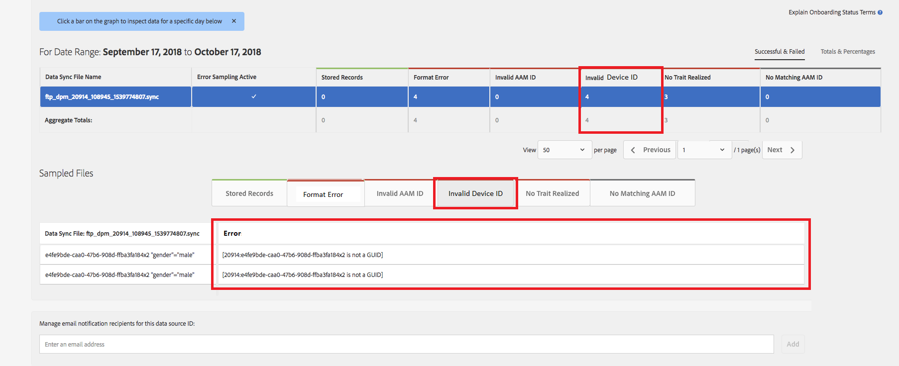

# Validierung der globalen Geräte-ID {#global-device-id-validation}

Geräte-Advertising-Identifikatoren (z. B. iDFA, GAID, Roku-ID) haben Formatierungsstandards, die eingehalten werden müssen, damit sie im digitalen Werbesystem verwendet werden können. Kunden und Partner können heute IDs in beliebige Formate hochladen, ohne darüber informiert zu werden, ob die ID korrekt formatiert ist. [!UICONTROL data sources] Dies geschieht in jeder Form. Mit dieser Funktion wird die Validierung von Geräte-IDs eingeführt, die zur ordnungsgemäßen Formatierung an die globale Plattform gesendet werden, und es wird eine Fehlermeldung angezeigt, wenn IDs nicht korrekt formatiert sind. [!UICONTROL data sources] Wir werden die Validierung für [!DNL iDFA], [!DNL Google Advertising] und [!DNL Roku IDs] beim Start unterstützen.

## Übersicht über Formatstandards {#overview-of-format-standards}

Im Folgenden sind die globalen ID-Pools für Gerätewerbung aufgeführt, die derzeit von AAM erkannt und unterstützt werden. Diese werden als freigegeben implementiert, [!UICONTROL Data Sources] die von jedem Kunden oder Datenpartner verwendet werden können, der mit Daten arbeitet, die an Benutzer dieser Plattformen gebunden sind.

<table>
  <tr>
   <td>Plattform </td>
   <td>AAM der Datenquellen-ID </td>
   <td>ID-Format </td>
   <td>AAM </td>
   <td>Hinweise </td>
  </tr>
  <tr>
   <td>Google Android (GAID)</td>
   <td>20914</td>
   <td>32 Hexadezimalzahlen, im Allgemeinen als 8-4-4-4-12-<em>Beispiel dargestellt, 97987bca-ae59-4c7d-94ba-ee4f19ab8c21  </em> </td>
   <td>1352</td>
   <td>Diese ID muss in einer Formularreferenz "unverschlüsselt/unverschlüsselt/unverändert"erfasst werden - <a href="https://play.google.com/about/monetization-ads/ads/ad-id/">https://play.google.com/about/monetization-ads/ads/ad-id/</a></td>
  </tr>
  <tr>
   <td>Apple iOS (IDFA)</td>
   <td>20915</td>
   <td>32 Hexadezimalzahlen, allgemein als <em>Beispiel 8-4-4-4-12 dargestellt, 6D92078A-8246-4BA4-AE5B-76104861E7DC  </em> </td>
   <td>3560</td>
   <td>Diese ID muss in einer Formularreferenz "unverschlüsselt/unverschlüsselt/unverändert"erfasst werden - <a href="https://support.apple.com/en-us/HT205223">https://support.apple.com/en-us/HT205223</a></td>
  </tr>
  <tr>
   <td>Roku (RIDA)</td>
   <td>121963</td>
   <td>32 Hexadezimalzahlen, im Allgemeinen als 8-4-4-4-12- <em>Beispiel dargestellt,</em> <em>fcb2a29c-315a-5e6b-bcfd-d889ba19aada</em></td>
   <td>11536</td>
   <td>Diese ID muss in einer Formularreferenz "unverschlüsselt/unverschlüsselt/unverändert"erfasst werden - <a href="https://sdkdocs.roku.com/display/sdkdoc/Roku+Advertising+Framework">https://sdkdocs.roku.com/display/sdkdoc/Roku+Advertising+Framework</a> </td>
  </tr>
  <tr>
   <td>Microsoft Advertising ID (MAID)</td>
   <td>389146</td>
   <td>Alphanumerische Zeichenfolge</td>
   <td>14593</td>
   <td>Diese ID muss in einer Formularreferenz "unverschlüsselt/unverschlüsselt/unverändert"erfasst werden - <a href="https://docs.microsoft.com/en-us/uwp/api/windows.system.userprofile.advertisingmanager.advertisingid">https://docs.microsoft.com/en-us/uwp/api/windows.system.userprofile.advertisingmanager.</a> <a href="https://msdn.microsoft.com/en-us/library/windows/apps/windows.system.userprofile.advertisingmanager.advertisingid.aspx">advertisingidhttps://msdn.microsoft.com/en-us/library/windows/apps/windows.system.userprofile.advertisingmanager.advertisingid.aspx</a></td>
  </tr>
  <tr>
   <td>Samsung DUID</td>
   <td>404660</td>
   <td>Beispiel für eine alphanumerische Zeichenfolge 7XCBNROQJQPYW</td>
   <td>15950</td>
   <td>Diese ID muss in einer Formularreferenz "unverschlüsselt/unverschlüsselt/unverändert"erfasst werden - <a href="https://developer.samsung.com/tv/develop/api-references/samsung-product-api-references/productinfo-api">https://developer.samsung.com/tv/develop/api-references/samsung-product-api-references/productinfo-api</a> </td>
  </tr>
</table>

## Einstellen einer Anzeigen-ID in der App {#setting-an-advertising-identifier-in-the-app}

Das Festlegen der Advertiser-ID in der App ist in der Tat ein zweistufiger Vorgang, bei dem zuerst die Advertiser-ID abgerufen und dann an das Experience Cloud gesendet wird. Die folgenden Links zeigen Ihnen, wie Sie diese Schritte durchführen können.

1. ID abrufen
   1. [!DNL Apple] Informationen über die [!DNL advertising ID] können Sie [HIER](https://developer.apple.com/documentation/adsupport/asidentifiermanager)finden.
   1. Einige Informationen zum Einrichten der [!DNL advertiser ID] für [!DNL Android] Entwickler finden Sie [HIER](http://www.androiddocs.com/google/play-services/id.html).
1. Senden Sie es mit der [!DNL setAdvertisingIdentifier] Methode im SDK an das Experience Cloud
   1. Informationen zur Verwendung `setAdvertisingIdentifier` finden Sie in der [Dokumentation](https://aep-sdks.gitbook.io/docs/using-mobile-extensions/mobile-core/identity/identity-api-reference#set-an-advertising-identifier) für sowohl [!DNL iOS] als auch [!DNL Android].

`// iOS (Swift) example for using setAdvertisingIdentifier:`
`ACPCore.setAdvertisingIdentifier([AdvertisingId]) // ...where [AdvertisingId] is replaced by the actual advertising ID`

## DCS-Fehlermeldungen für falsche IDs  {#dcs-error-messaging-for-incorrect-ids}

Wenn eine falsche globale Geräte-ID (IDFA, GAID usw.) in Echtzeit an Audience Manager gesendet wird, wird beim Treffer ein Fehlercode zurückgegeben. Im Folgenden finden Sie ein Beispiel für einen Fehler, der zurückgegeben wird, weil die ID als eine gesendet wird, [!DNL Apple IDFA]die nur Großbuchstaben enthalten sollte, und trotzdem gibt es in der ID eine Kleinbuchstabe &quot;x&quot;.

Informationen zur Liste von Fehlercodes finden Sie in der [Dokumentation](https://experienceleague.adobe.com/docs/audience-manager/user-guide/api-and-sdk-code/dcs/dcs-api-reference/dcs-error-codes.html?lang=en#api-and-sdk-code) .

## Integrierte globale Geräte-IDs {#onboarding-global-device-ids}

Neben der Echtzeit-Übermittlung globaler Geräte-IDs können Sie auch Daten mit den IDs &quot;[!DNL onboard]&quot;(Hochladen) hochladen. Dieser Vorgang ist der gleiche wie bei der Einbindung von Daten mit Ihren Kunden-IDs (in der Regel über Schlüssel/Wert-Paare). Sie würden jedoch einfach die richtigen Datenquellen-IDs verwenden, damit die Daten der globalen Geräte-ID zugewiesen werden. Die Dokumentation zum Einstieg finden Sie in der [Dokumentation](https://experienceleague.adobe.com/docs/audience-manager/user-guide/implementation-integration-guides/sending-audience-data/batch-data-transfer-process/batch-data-transfer-overview.html?lang=en#implementation-integration-guides). Denken Sie daran, die globale [!UICONTROL data source] ID zu verwenden, abhängig von der Plattform, die Sie verwenden.

Wenn beim Einstieg falsche globale Geräte-IDs gesendet werden, werden die Fehler im [[!DNL Onboarding Status Report]](https://experienceleague.adobe.com/docs/audience-manager/user-guide/reporting/onboarding-status-report.html?lang=en#reporting)Bildschirm angezeigt.

Im Folgenden finden Sie ein Beispiel für einen Fehler, der durch diesen Bericht ausgegeben wird:

