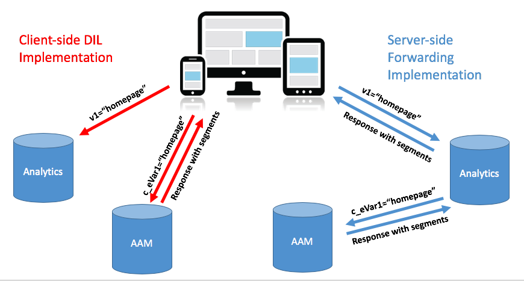
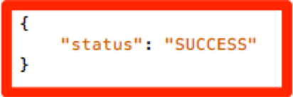

# Migrieren der AAM Ihrer Site von [!DNL Client-Side] DIL zu [!DNL Server-Side Forwarding] {#migrating-your-site-s-aam-implementation-from-client-side-dil-to-server-side-forwarding}

Dieses Tutorial gilt für Sie, wenn Sie sowohl über Adobe Audience Manager (AAM) als auch Adobe Analytics verfügen und derzeit einen Treffer von der Seite an AAM mit dem Code &quot;DIL&quot;([!DNL Data Integration Library]) senden und außerdem einen Treffer von der Seite an Adobe Analytics senden. Da Sie über beide Lösungen verfügen und beide Teil der Adobe Experience Cloud sind, haben Sie die Möglichkeit, die Best Practice zu befolgen, nämlich &quot;[!DNL Server-Side Forwarding] (SSF)&quot;zu aktivieren, wodurch die Datenerfassungsserver [!DNL Analytics] die Site-Analysedaten in Echtzeit an den Audience Manager weiterleiten können, anstatt dass [!DNL client-side]-Code einen zusätzlichen Treffer von der Seite an die AAM sendet. Dieses Tutorial führt Sie durch die Schritte, die erforderlich sind, um den Wechsel von der älteren Implementierung &quot;[!DNL Client-Side DIL]&quot;zur neueren Methode &quot;[!DNL Server-Side forwarding]&quot;vorzunehmen.

## [!DNL Client-Side] (DIL) vs.  [!DNL Server-Side] {#client-side-dil-vs-server-side}

Beim Vergleichen und Vergleichen dieser beiden Methoden zur Datenübernahme in AAM kann es hilfreich sein, die Unterschiede im folgenden Bild zu visualisieren:

### [!DNL Client-side] DIL-Implementierung {#client-side-dil-implementation}

Wenn Sie diese Methode verwenden, um Adobe Analytics-Daten in AAM zu übertragen, bedeutet dies, dass Sie zwei Treffer von Ihren Webseiten haben: Gehen Sie zu [!DNL Analytics] und gehen Sie AAM (nachdem Sie die [!DNL Analytics]-Daten auf die Webseite kopiert haben. [!UICONTROL Segments] werden von AAM an die Seite zurückgegeben, wo sie für die Personalisierung verwendet werden können usw. Dies gilt als &quot;ältere&quot;Implementierung und wird nicht mehr empfohlen.

Abgesehen davon, dass dies nicht den Best Practices folgt, bestehen die Nachteile der Verwendung dieser Methode darin,

* Zwei Treffer von der Seite anstelle von nur einem
* [!UICONTROL Server-Side Forwarding] ist für die Echtzeit-Freigabe von AAM Zielgruppen in erforderlich,  [!DNL Analytics]sodass  [!DNL Client-side] Implementierungen diese Funktion (und möglicherweise andere Funktionen in der Zukunft) nicht zulassen.

Es wird empfohlen, zu einer [!UICONTROL Server-Side Forwarding]-Methode zur AAM Implementierung zu wechseln.

### [!UICONTROL Server-Side Forwarding] Implementierung {#server-side-forwarding-implementation}

Wie in der Abbildung oben gezeigt, kommt ein Treffer von der Webseite nach Adobe Analytics. [!DNL Analytics] leitet diese Daten dann an AAM in Echtzeit weiter und Besucher werden in AAM  [!UICONTROL traits] und  [!UICONTROL segments]ausgewertet, so als ob der Treffer direkt von der Seite kam.

[!UICONTROL Segments] werden bei demselben Echtzeit-Treffer zurück an zurückgegeben,  [!DNL Analytics]wodurch die Antwort zur Personalisierung an die Webseite weitergeleitet wird.

Für die Umstellung auf die serverseitige Weiterleitung gibt es kein Timing nach unten. Es wird dringend empfohlen, dass alle Benutzer, die sowohl über Audience Manager als auch über [!DNL Analytics] verfügen, diese Implementierungsmethode verwenden.

## Sie haben zwei Hauptaufgaben: {#you-have-two-main-tasks}

Auf dieser Seite gibt es eine Menge Informationen, und es ist natürlich alles wichtig. **alles läuft jedoch auf zwei wichtige Dinge hinaus, die Sie tun müssen**:

1. Ändern Sie den Code von [!DNL Client-Side] DIL-Code in [!UICONTROL Server-Side Forwarding]-Code
1. Spiegeln Sie den Schalter in [!DNL Analytics] [!DNL Admin Console], um die tatsächliche Weiterleitung der Daten zu starten (per [!UICONTROL report suite]).

Wenn Sie eine dieser beiden Optionen überspringen, funktioniert SSF nicht ordnungsgemäß. In diesem Dokument wurden Schritte und zusätzliche Daten hinzugefügt, die Ihnen bei der korrekten Durchführung dieser beiden Schritte helfen.

## Implementierungsoptionen {#implementation-options}

Wenn Sie von [!DNL client-side] zu [!DNL server-side] wechseln, besteht eine der Aufgaben darin, den Code in den neuen [!UICONTROL Server-Side Forwarding]-Code zu ändern. Dies geschieht mit einer der folgenden Optionen:

* Adobe Experience Platform Launch - Unsere empfohlene Implementierungsoption für Webeigenschaften. Sie werden sehen, dass dies eine sehr einfache Aufgabe ist, denn [!DNL Launch] hat alle harten Sachen für Sie gemacht.
* Auf der Seite - Sie können den neuen SSF-Code auch direkt in die Funktion `doPlugins` in Ihrer [!DNL appMeasurement.js]-Datei platzieren, wenn Sie (noch) nicht mit Adobe Launch arbeiten
* Andere Tag-Manager - Diese können wie die vorherige Option (Auf der Seite) behandelt werden, da Sie den SSF-Code immer noch in `doPlugins` platzieren, wo immer der andere Tag-Manager den [!DNL AppMeasurement]-Code speichert

Im Abschnitt Aktualisieren des Codes werden wir uns jeden dieser Punkte ansehen.

## Implementierungsschritte {#implementation-steps}

### Schritt 0: Voraussetzung: Experience Cloud-ID-Dienst (ECID) {#step-prerequisite-experience-cloud-id-service-ecid}

Die wichtigste Voraussetzung für den Wechsel zu [!UICONTROL Server-Side Forwarding] ist die Implementierung des Experience Cloud-ID-Diensts. Dies ist am einfachsten, wenn Sie Experience Platform Launch verwenden. In diesem Fall installieren Sie einfach die ECID-Erweiterung und der Rest wird ausgeführt.

Wenn Sie ein TMS ohne Adobe oder gar kein TMS verwenden, implementieren Sie bitte ECID, um **vor** anderen Adobe-Lösungen auszuführen. Weitere Informationen finden Sie in der [ECID-Dokumentation](https://experienceleague.adobe.com/docs/id-service/using/home.html) . Die einzige andere Voraussetzung betrifft Codeversionen. Wenn Sie also einfach die neuesten Versionen des Codes in den folgenden Schritten anwenden, ist Ihnen das recht.

>[!NOTE]
>
>Lesen Sie vor der Implementierung dieses gesamten Dokuments. Der unten stehende Abschnitt &quot;Timing&quot;enthält wichtige Informationen zu *wann* Sie sollten jedes Element implementieren, einschließlich ECID (sofern es noch nicht implementiert ist).

### Schritt 1: Derzeit verwendete Optionen aus DIL-Code aufzeichnen {#step-record-currently-used-options-from-dil-code}

Wenn Sie bereit sind, von [!DNL Client-Side] DIL-Code zu [!UICONTROL Server-Side Forwarding] zu wechseln, besteht der erste Schritt darin, alles zu identifizieren, was Sie mit DIL-Code tun, einschließlich benutzerdefinierter Einstellungen und Daten, die an AAM gesendet werden. Zu beachten und zu berücksichtigen sind unter anderem:

* Normale [!DNL Analytics] -Variablen, die das [!DNL siteCatalyst.init] -DIL-Modul verwenden - Sie müssen sich keine Gedanken über dieses Modul machen, da es nur darum geht, die normalen [!DNL Analytics] -Variablen zu senden, was durch die einfache Aktivierung von SSF geschieht.
* Partner-Subdomäne - Notieren Sie sich in der Funktion DIL.create den Parameter `partner` . Dies wird als &quot;Partner-Subdomäne&quot;oder manchmal als &quot;Partner-ID&quot;bezeichnet und wird benötigt, wenn Sie den neuen SSF-Code platzieren.
* [!DNL Visitor Service Namespace] - Wird auch als &quot;[!DNL Org ID]&quot;oder &quot;[!DNL IMS Org ID]&quot;bezeichnet und wird auch bei der Einrichtung des neuen SSF-Codes benötigt. Notieren Sie sich das.
* containerNSID, uuidCookie und andere erweiterte Optionen - Notieren Sie sich alle zusätzlichen erweiterten Optionen, die Sie verwenden, damit Sie sie auch im SSF-Code festlegen können.
* Zusätzliche Seitenvariablen - Wenn andere Variablen von der Seite an AAM gesendet werden (zusätzlich zu den normalen [!DNL Analytics] -Variablen, die von SiteCatalyst.init verarbeitet werden), müssen Sie sie beachten, damit sie über SSF (Spoiler-Warnung: über [!DNL contextData] -Variablen).

### Schritt 2: Aktualisieren des Codes {#step-updating-the-code}

Im obigen Abschnitt mit dem Titel &quot;Implementierungsoptionen&quot;werden mehrere Optionen bezüglich der Implementierung von [!UICONTROL Server-Side Forwarding] angegeben. Damit dieser Abschnitt effektiv sein kann, müssen wir ihn in diese Abschnitte unterteilen (mit zwei davon zusammen). Gehen Sie zur Methode dieses Abschnitts , die Ihre Anforderungen am besten beschreibt.

#### Adobe Experience Platform Launch {#launch-by-adobe}

Sehen Sie sich das folgende Video an, um mehr über das Verschieben von Implementierungsoptionen von [!DNL Client-Side] DIL-Code in [!UICONTROL Server-Side Forwarding] im Experience Platform Launch zu erfahren.

>[!VIDEO](https://video.tv.adobe.com/v/26310/?quality=12)

#### &quot;Auf der Seite&quot;oder &quot;Nicht-Adobe Tag Manager&quot; {#on-the-page-or-non-adobe-tag-manager}

Sehen Sie sich das folgende Video an, um mehr über das Verschieben von Implementierungsoptionen vom [!DNL Client-Side]-DIL-Code in [!UICONTROL Server-Side Forwarding] im [!DNL AppMeasurement]-Code zu erfahren, der sich entweder in einer -Datei oder in einem Nicht-Adobe-Tag-Management-System befindet.

>[!VIDEO](https://video.tv.adobe.com/v/26312/?quality=12)

### Schritt 3: Aktivieren der Weiterleitung (per [!UICONTROL Report Suite]) {#step-enabling-the-forwarding-per-report-suite}

Bis jetzt haben wir in diesem Tutorial die ganze Zeit damit verbracht, den Code von [!DNL Client-Side DIL] -Code auf [!UICONTROL Server-Side Forwarding] zu wechseln. Das ist in Ordnung, denn es ist der schwierigere Teil. Dieser Abschnitt ist zwar sehr einfach, aber ebenso wichtig wie die Aktualisierung des Codes. In diesem Video erfahren Sie, wie Sie den Schalter umdrehen, der die tatsächliche Weiterleitung von Daten von Analytics an Audience Manager ermöglicht.

>[!VIDEO](https://video.tv.adobe.com/v/26355/?quality-12)

**HINWEIS:** Wie im Video angegeben, dauert es bis zu 4 Stunden, bis die Weiterleitung vollständig im Experience Cloud-Backend implementiert werden kann.

## Zeit {#timing}

Zur Erinnerung: Es gibt zwei Hauptaufgaben, die den Übergang von [!DNL Client-Side DIL] zu [!UICONTROL Server-Side Forwarding] ermöglichen:

1. Aktualisieren des Codes
1. Spiegeln des Switches im [!DNL Analytics] [!DNL Admin Console]

Aber die Frage ist: Welches ist zuerst? Ist es wichtig? Ok, tut mir leid, das waren zwei Fragen. Aber die Antworten sind... es kommt darauf an und ja, es *can* zählt. Wie ist das für vage? Teilen wir es auf! Zunächst jedoch eine zusätzliche Frage, die sich stellen kann, wenn Sie eine große Organisation mit vielen Sites sind: Muss ich alles auf einmal machen? Das ist ein bisschen leichter. Keine Hoffnung. Man kann es Stück für Stück machen... irgendwie. :)

### Ein kleiner tieferer Tauchgang {#a-little-deeper-dive}

Der Grund, warum Timing und Reihenfolge wichtig sind, liegt darin, wie die Weiterleitung *wirklich *funktioniert, was in den folgenden technischen Fakten zusammengefasst werden kann:

* Wenn der Experience Cloud-ID-Dienst (ECID) implementiert ist und der Wechsel im [!DNL Analytics] [!DNL Admin Console] (&quot;der Schalter&quot;) eingeschaltet ist, werden die Daten von [!DNL Analytics] an AAM weitergeleitet, auch wenn Sie den Code noch nicht aktualisiert haben.
* Wenn Sie ECID nicht implementiert haben, werden die Daten nicht weitergeleitet, auch wenn Sie den Umschalter aktiviert haben und den SSF-Code haben.
* Der SSF-Code (ob in [!DNL Launch] oder auf der Seite) verarbeitet die Antwort wirklich und ist natürlich notwendig, um die Migration abzuschließen.
* Beachten Sie, dass der SSF-Switch durch [!UICONTROL Report Suite] aktiviert ist, der Code jedoch von der Eigenschaft in [!DNL Launch] oder von der Datei [!DNL AppMeasurement] verarbeitet wird, wenn Sie [!DNL Launch] nicht verwenden.

### Best Practices {#best-practices}

Basierend auf diesen technischen Details finden Sie hier die Empfehlungen für den Zeitplan für &quot;Was soll ich wann tun?&quot;:

#### Wenn Sie noch NICHT ECID implementiert haben {#if-you-do-not-have-ecid-yet-implemented}

1. Spiegeln Sie den Switch in [!DNL Analytics] für jeden [!UICONTROL report suite], den Sie für SSF aktivieren.

   1. Die Weiterleitung wird noch nicht gestartet, da Sie keine ECID haben

1. Aktualisieren Sie Ihren Code pro Site von [!DNL Client-Side DIL] auf SSF (dies kann sich in [!DNL Launch] oder auf der Seite befinden, wie in einem anderen Abschnitt oben beschrieben).

   1. Die Weiterleitung erfolgt jetzt (wie Sie ECID hinzugefügt haben) und Sie sollten auch eine ordnungsgemäße JSON-Antwort auf Ihr [!DNL Analytics]-Beacon erhalten (weitere Informationen finden Sie im Abschnitt &quot;Validierung und Fehlerbehebung&quot;unten).

#### Wenn ECID implementiert ist {#if-you-do-have-ecid-implemented}

1. Bereiten Sie vor und planen Sie, dass Sie bereit sind, Ihren Code von DIL auf SSF PER [!UICONTROL report suite] zu aktualisieren, damit Sie ihn für SSF aktivieren:

   1. Spiegeln Sie den Switch in [!DNL Analytics], um SSF zu aktivieren.

      1. Die Weiterleitung beginnt, da ECID aktiviert ist.
   1. Aktualisieren Sie Ihren Code so bald wie möglich von [!DNL Client-Side DIL] auf SSF (dies kann sich in [!DNL Launch] oder auf der Seite befinden, wie in einem anderen Abschnitt oben beschrieben).

      1. Sie sollten eine richtige JSON-Antwort auf Ihr [!DNL Analytics]-Beacon erhalten (weitere Informationen finden Sie im Abschnitt Validierung und Fehlerbehebung unten).

**HINWEIS 1:** Es ist wichtig, diese beiden Schritte möglichst nahe beieinander zu platzieren, da zwischen den Schritten 1 und 2 oben Duplikate von Daten vorliegen, die in AAM gehen. Mit anderen Worten: SSF hat begonnen, Daten von [!DNL Analytics] an AAM zu senden. Da sich der DIL-Code noch auf der Seite befindet, wird auch ein Treffer direkt von der Seite in AAM gesendet, wodurch die Daten verdoppelt werden. Sobald Sie den Code von DIL auf SSF aktualisieren, wird dies gelindert.

**HINWEIS 2:** Wenn Sie eher eine kleine Datendiskrepanz als eine kleine Datenduplizierung wünschen, können Sie die Reihenfolge der Schritte 1 und 2 oben ändern. Wenn Sie den Code von DIL auf SSF verschieben, würde der Datenfluss in AAM gestoppt, bis Sie den Switch zum Aktivieren der SSF für [!UICONTROL report suite] umschalten konnten. Normalerweise möchten Kunden eher eine kleine Datenverdoppelt haben, als Besucher in [!UICONTROL traits] und [!UICONTROL segments] zu verpassen.

#### Migrationszeit bei vielen Sites und [!UICONTROL Report Suites] {#migration-timing-when-you-have-many-sites-and-report-suites}

Dieses Thema wird in früheren Abschnitten kurz angesprochen, da die Hauptstrategie wie folgt zusammengefasst werden kann:

Migrieren Sie jeweils eine Site/[!UICONTROL report suite] (oder Site-Gruppe/[!UICONTROL report suites]).

Dies kann jedoch anhand einiger möglicher Szenarien etwas schwierig werden:

* Sie haben eine Site, die mehrere verschiedene [!UICONTROL report suites]
* Sie haben eine [!UICONTROL report suite] , die mehrere Sites enthält (z. B. eine globale [!UICONTROL report suite]).
* Sie verwenden eine [!DNL Launch]-Eigenschaft, um mehrere Sites zu bedecken.
* Sie haben verschiedene Entwicklungsteams für verschiedene Sites

Aufgrund dieser Elemente kann es ein wenig kompliziert werden. Die besten Dinge, die ich vorschlagen kann, sind:

* Nehmen Sie sich etwas Zeit, um eine Strategie für die Migration auf SSF zu entwickeln, die auf den oben erläuterten Elementen basiert
* Da eine einzelne Eigenschaft in [!DNL Launch] (oder eine einzelne [!DNL AppMeasurement]-Datei) normalerweise einer oder zwei verschiedenen [!UICONTROL report suites] zugeordnet wird, können Sie wahrscheinlich einen Plan erstellen, der für diese unterschiedlichen Gruppen einzeln funktioniert, und Ihr Unternehmen auf SSF aktualisieren
* Wenn Sie mit Adobe Consulting zusammenarbeiten, sprechen Sie mit ihnen über Ihren Migrationsplan, damit sie bei Bedarf helfen können

## Validierung und Fehlerbehebung {#validation-and-troubleshooting}

Die Hauptmethode zum Überprüfen, ob [!UICONTROL Server-Side Forwarding] aktiv ist, besteht darin, die Antwort auf einen Ihrer Adobe Analytics-Treffer zu überprüfen, die von der App kommen.

Wenn Sie keine [!UICONTROL server-side forwarding]-Daten von [!DNL Analytics] zum Audience Manager verwenden, gibt es keine Antwort auf das [!DNL Analytics]-Beacon (abgesehen von einem 2x2-Pixel). Wenn Sie jedoch SSF verwenden, können Sie in der [!DNL Analytics]-Anfrage und -Antwort überprüfen, ob [!DNL Analytics] ordnungsgemäß mit dem Audience Manager kommuniziert, den Treffer weiterleitet und eine Antwort erhält.

>[!VIDEO](https://video.tv.adobe.com/v/26359/?quality=12)

**Warnung:**  Vorsicht vor dem falschen &quot;Erfolg&quot;- Wenn eine Antwort vorliegt und alles zu funktionieren scheint, stellen Sie sicher, dass in der Antwort das &quot;stuff&quot;-Objekt enthalten ist. Wenn nicht, wird möglicherweise eine Meldung mit [!DNL "status":"SUCCESS"] angezeigt. So verrückt das auch klingt, das ist der Beweis dafür, dass es nicht richtig funktioniert. Wenn Sie dies sehen, bedeutet dies, dass Sie die Codeaktualisierung in [!DNL Launch] oder [!DNL AppMeasurement] abgeschlossen haben, die Weiterleitung in [!DNL Analytics] [!DNL Admin Console] jedoch noch nicht abgeschlossen ist. In diesem Fall müssen Sie überprüfen, ob Sie SSF im [!DNL Analytics] [!DNL Admin Console] für [!UICONTROL report suite] aktiviert haben. Wenn Sie dies haben und es noch nicht 4 Stunden gedauert hat, sollten Sie geduldig sein, da es so lange dauern kann, alle notwendigen Änderungen am Backend vorzunehmen.

Weitere Informationen zu [!UICONTROL Server-Side Forwarding] finden Sie in der [Dokumentation](https://experienceleague.adobe.com/docs/analytics/admin/admin-tools/server-side-forwarding/ssf.html).
