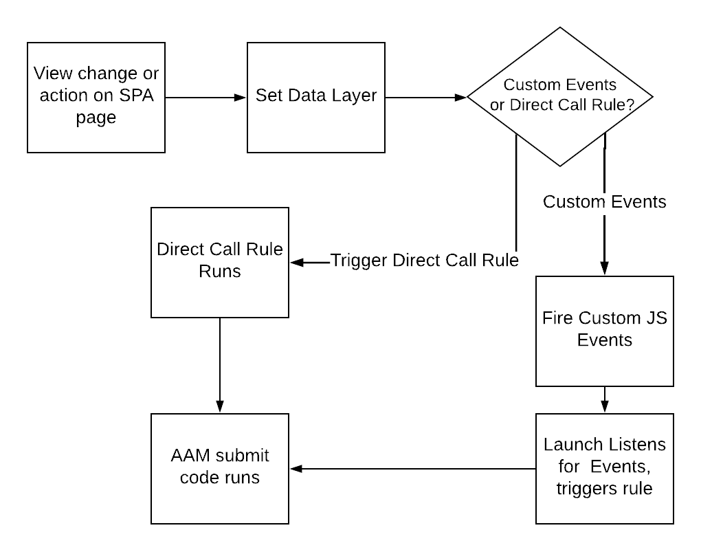

# Verwenden Sie Best Practices beim Senden von Daten an AAM SPA Seiten {#using-best-practices-on-spa-pages-when-sending-data-to-aam}

In diesem Dokument werden verschiedene Best Practices zum Senden von Daten von Einzelseitenanwendungen (SPA) an Adobe Audience Manager (AAM) beschrieben. Dieser Artikel konzentriert sich auf die Verwendung von [!UICONTROL Experience Platform tags], die empfohlene Implementierungsmethode.

## Anfängliche Hinweise

* Bei den folgenden Elementen wird davon ausgegangen, dass Sie Platform-Tags verwenden, um auf Ihrer Site zu implementieren. Wenn Sie keine Platform-Tags verwenden, sind diese jedoch an Ihre Implementierungsmethode anzupassen.
* Alle SPA unterscheiden sich, sodass Sie möglicherweise einige der folgenden Elemente anpassen müssen, um Ihre Anforderungen am besten zu erfüllen. Adobe möchte jedoch einige Best Practices teilen, über die Sie beim Senden von Daten von SPA an Audience Manager nachdenken müssen.

## Einfaches Diagramm zum Arbeiten mit SPA und AAM in Experience Platform-Tags (früher Launch){#simple-diagram-of-working-with-spas-and-aam-in-experience-platform-launch}

>[!NOTE]
>Wie angegeben, ist dies ein vereinfachtes Diagramm dazu, wie SPA Seiten in einer Adobe Audience Manager-Implementierung (ohne Adobe Analytics) mit Platform-Tags verarbeitet werden. Wie Sie sehen können, ist es recht unkompliziert, wobei die große Entscheidung darin liegt, wie Sie eine Änderung der Ansicht (oder eine Aktion) an Platform-Tags weiterleiten.

## Auslösen von Tags von der SPA {#triggering-launch-from-the-spa-page}

Zwei der gängigeren Methoden zum Auslösen einer Regel in Platform-Tags (und somit zum Senden von Daten in Audience Manager) sind:

* Festlegen benutzerdefinierter JavaScript-Ereignisse (siehe Beispiel) [HIER](https://helpx.adobe.com/analytics/kt/using/spa-analytics-best-practices-feature-video-use.html) mit Adobe Analytics)
* Verwenden eines [!UICONTROL Direct Call Rule]

In diesem Audience Manager verwenden Sie eine [!UICONTROL Direct Call rule] in Platform-Tags , um den Treffer Trigger, der in den Audience Manager gesendet wird. Wie Sie in den nächsten Abschnitten sehen werden, ist dies nützlich, indem Sie die [!UICONTROL Data Layer] auf einen neuen Wert hinzu, damit er von der [!UICONTROL Data Element] in Platform-Tags.

## Demoseite {#demo-page}

Hier ist eine kleine Seite, die zeigt, wie Sie einen Wert in der Datenschicht ändern und ihn wie auf einer SPA an Audience Manager senden. Diese Funktion kann für detailliertere Änderungen modelliert werden, die erforderlich sind. Sie finden diese Demoseite [HIER](https://aam.enablementadobe.com/SPA-Launch.html).

## Festlegen der Datenschicht {#setting-the-data-layer}

Wie bereits erwähnt, muss beim Laden neuer Inhalte auf der Seite oder beim Ausführen einer Aktion auf der Site die Datenschicht dynamisch im Kopf der Seite festgelegt werden, BEVOR Platform-Tags aufgerufen werden und die [!UICONTROL rules], damit Platform-Tags die neuen Werte aus der Datenschicht abrufen und in den Audience Manager übertragen können.

Wenn Sie die oben aufgeführte Demosite aufrufen und sich die Seitenquelle ansehen, sehen Sie:

* Die Datenschicht befindet sich im Kopf der Seite, bevor Platform-Tags aufgerufen werden
* Das JavaScript im simulierten SPA-Link ändert die [!UICONTROL Data Layer]und ruft dann Platform-Tags (die `_satellite.track()` -Aufruf). Wenn Sie stattdessen benutzerdefinierte JavaScript-Ereignisse verwenden [!UICONTROL Direct Call Rule], ist die Lektion die gleiche. Ändern Sie zuerst die [!DNL data layer]und rufen Sie dann Platform-Tags auf.

>[!VIDEO](https://video.tv.adobe.com/v/23322/?quality=12)

## Zusätzliche Ressourcen {#additional-resources}

* [SPA über die Adobe](https://forums.adobe.com/thread/2451022)
* [Referenzarchitektur-Sites zur Implementierung von SPA in Platform-Tags](https://helpx.adobe.com/experience-manager/kt/integration/using/launch-reference-architecture-SPA-tutorial-implement.html)
* [Verwenden von Best Practices beim SPA in Adobe Analytics](https://helpx.adobe.com/analytics/kt/using/spa-analytics-best-practices-feature-video-use.html)
* [Für diesen Artikel verwendete Demosite](https://aam.enablementadobe.com/SPA-Launch.html)
